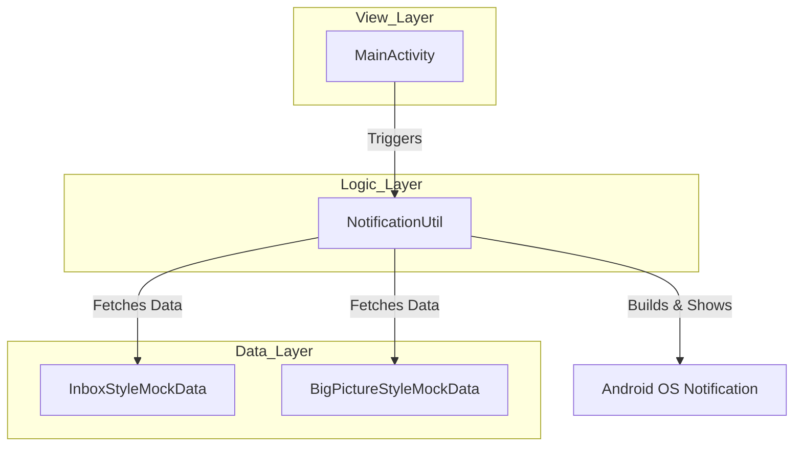
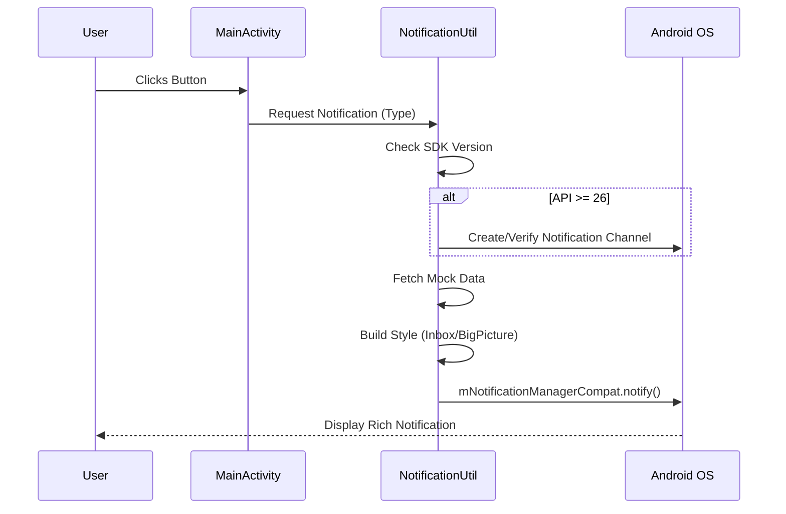

# 🚀 NotificationsSample: Master Android Notifications with Kotlin

<div align="center">
  
  
  
  
</div>

---

## 📖 Overview

**NotificationsSample** is a specialized educational project designed to explore the depths of the **Android Notification System**. Developed with a focus on Modern Android Development (MAD) practices, this application serves as a comprehensive guide for implementing sophisticated notification styles, managing notification channels, and ensuring compatibility across different Android API levels (up to Android 14).

This project was built to transition from basic Android concepts to advanced system interactions, specifically focusing on user engagement through rich, actionable notifications.

---

## 🎨 Visual Showcase


---

## 🛠 Features & Implementations

### 1. 📬 Inbox Style Notifications
- **Purpose**: Ideal for displaying multiple lines of information, such as snippets from several new emails.
- **Key Class**: `NotificationCompat.InboxStyle()`
- **Implementation**: Dynamically adds up to 5 summary lines from `InboxStyleMockData`.

### 2. 🖼 Big Picture Style Notifications
- **Purpose**: Focuses on visual content, perfect for social media posts or image-heavy updates.
- **Key Class**: `NotificationCompat.BigPictureStyle()`
- **Implementation**: Renders a large bitmap (Earth image) with overridden content titles and summary text.

### 3. 🛡 Notification Channels (API 26+)
- **Importance Management**: Different importance levels (High for Social, Default for Email).
- **Customization**: Implementation of vibration patterns, lock screen visibility, and user-visible descriptions.

### 4. 🔄 Modern Android Compatibility
- **Android 12+ Support**: Explicit `android:exported` handling.
- **API 34 Targeting**: Optimized for the latest Android 14 features and security requirements.

---

## 🏗 Architecture & Flow

### MVVM Architectural Pattern
The project follows a clean architecture approach, separating data concerns from UI logic.



### Notification Generation Flow



---

## 📊 MAD Score Breakdown

| Category | Usage | Score |
| :--- | :--- | :--- |
| **Language** | 100% Kotlin | ⭐⭐⭐⭐⭐ |
| **Tooling** | Gradle 8.5, AGP 8.0.0 | ⭐⭐⭐⭐⭐ |
| **API Level** | Target SDK 34 (Android 14) | ⭐⭐⭐⭐⭐ |
| **Components** | NotificationCompat, KTX | ⭐⭐⭐⭐ |
| **Architecture** | Component-based separation | ⭐⭐⭐⭐ |

---

## 💻 Tech Stack

- **Language**: [Kotlin](https://kotlinlang.org/)
- **UI Framework**: XML Layouts with Material Design 3
- **Build System**: Gradle Kotlin DSL / Groovy
- **Libraries**:
    - `androidx.core:core-ktx`: Concise Kotlin extensions.
    - `androidx.appcompat`: Compatibility for older versions.
    - `com.google.android.material`: UI components.

---

## ⚙️ Setup Instructions

1. **Clone the Repository**:
   ```bash
   git clone https://github.com/yourusername/NotificationsSample.git
   ```
2. **Open in Android Studio**:
   - Ensure you are using **Android Studio Hedgehog** or newer.
   - JDK version should be **21**.
3. **Build & Run**:
   - Select the `app` module and click **Run**.
   - Compatible with devices running API 21 (Lollipop) and above.

---

## 🎓 Learning Outcomes

Through this project, I mastered:
- The nuances of `NotificationManager` vs `NotificationManagerCompat`.
- Programmatic bitmap handling for `BigPictureStyle`.
- Strict requirement handling for `PendingIntent` and `Intent` flags in newer Android versions.
- Workspace migration and package refactoring in a live project.

---

<div align="center">
  <p>Developed with ❤️ for the Android Community</p>
</div>
